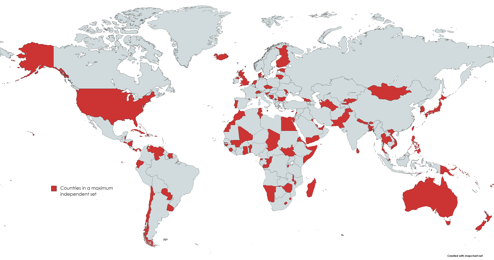

# Country-borders-project

A thought hit me one day: "what is the largest set of countries you can have such that no pair of countries in the set border each other?"

Seeing no answer online, I decided to find this out myself. Mathematically, this is equivalent to asking "Let G be the undirected graph where the vertices are nations and pairs of vertices are adjacent if the corresponding countries have a land border. What is a maximum independent set of G?" The list of countries I'll be using is all the UN member states, plus Palestine, Holy See, Taiwan and Kosovo. I might do this without Kosovo to see if it makes a difference. I might find other interesting statistics about country borders as well.

## Result

This is the result given to me by my algorithm and one of many possible maximum independent sets. A maximum independent set consists of 112 countries.

Czechia, Congo, Benin, Georgia, Kosovo, Lesotho, Tuvalu, Fiji, Tunisia, Palau, Belize, South Sudan, Cabo Verde, Lithuania, Saint Lucia, Switzerland, Kuwait, Lebanon, Somalia, Jordan, Turkmenistan, Sri Lanka, Tonga, Holy See, Estonia, Panama, Maldives, Saint Vincent and the Grenadines, Malta, Eritrea, Chad, Paraguay, Bahamas, Zimbabwe, Mali, Eswatini, Thailand, Finland, Sierra Leone, United Kingdom, Marshall Islands, Guinea-Bissau, Ghana, Bulgaria, Ecuador, El Salvador, Taiwan, South Korea, Namibia, Slovenia, Federated States of Micronesia, Nicaragua, Morocco, Monaco, Comoros, Luxembourg, Portugal, Bosnia and Herzegovina, the Gambia , Haiti, Venezuela, Saint Kitts and Nevis, Bangladesh, Pakistan, Mauritius, Nepal, Sao Tome and Principe, Barbados, Papua New Guinea, Madagascar, Antigua and Barbuda, Equatorial Guinea, Nauru, Moldova, San Marino, Malawi, Brunei Darussalam, Bahrain, Burundi, Chile, Suriname, Qatar, Jamaica, New Zealand, Australia, Philippines, Singapore, Timor-Leste, Cyprus, Samoa, Seychelles, Denmark, Kiribati, Netherlands, United States of America, Egypt, Iceland, Kyrgyzstan, Cuba, Dominica, Mongolia, Trinidad and Tobago, Bhutan, Uruguay, Vietnam, Yemen, United Arab Emirates, Solomon Islands, Japan, Andorra, Vanuatu, Grenada

## Sources

The country border dataset was originally from [The dataset by geodatasource](https://github.com/geodatasource/country-borders).
The database has been edited to exclude territories and dependencies, to incorporate Western Sahara into Morocco, to include Kosovo and to include the new Danish-Canadian land border.
